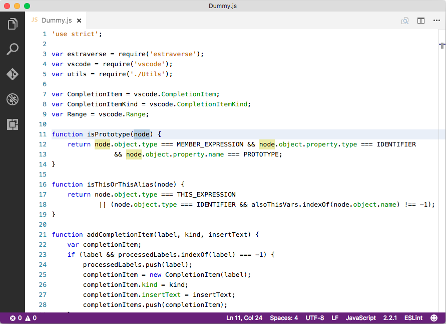

# NetBeans Light Theme

This VS Code Theme extension tries to setup editor colors to same colors which are used in default NetBeans IDE light theme.

Currently supported languages:
- JavaScript (JSON)
- TypeScript
- HTML
- CSS
- Java
- PHP



Feel free to file your change requests and issues to [issue tracker](https://github.com/obrejla/vscode-netbeans-light-theme/issues) ;-)

**Enjoy!**

## Building

Make sure you have Node.js installed. Then run:

```
npm install -g @vscode/vsce

$ cd myExtension
$ vsce package
# myExtension.vsix generated
$ vsce publish
# <publisher id>.myExtension published to VS Code Marketplace
```
